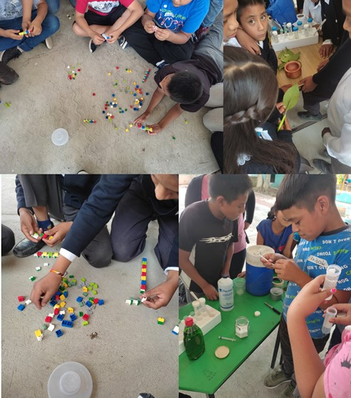
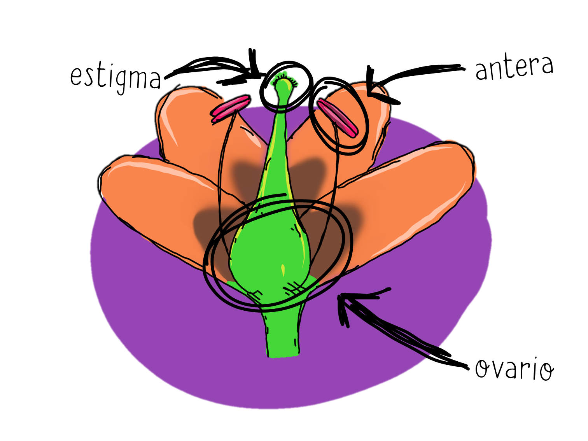
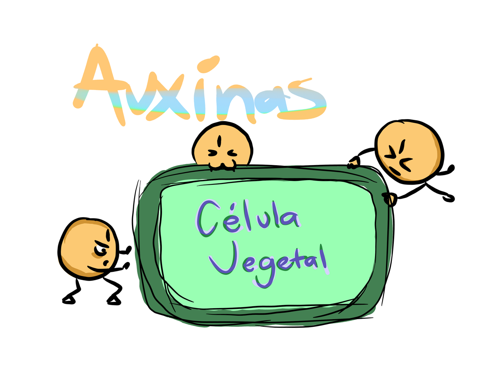
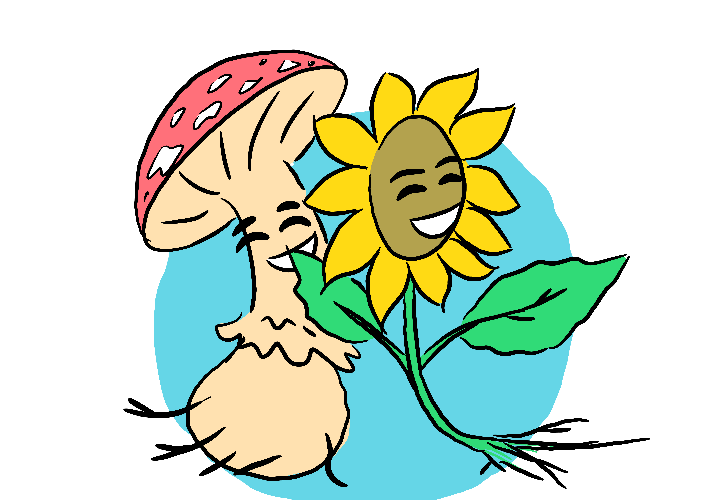

## Este blog recopila las actividades y memoriales resultantes de este proyecto, su mayoría en Español.

# Talleres de divulgación en escuelas primarias rurales
** Mayo, 2021**

# [Fitoman y las Semillas: inicia la vida de una planta](https://www.facebook.com/BCEGWigbertoJimenezMoreno/videos/dosis-de-ciencia-para-ni%C3%B1os/331881044641816/)
**23 de Julio, 2020**

# [Las plantas en la adolescencia](https://www.facebook.com/BCEGWigbertoJimenezMoreno/videos/dosis-de-ciencia-para-ni%C3%B1os/2715750965368765/)
**27 de Agosto, 2020**

# [Cuando las plantas son grandes](https://fb.watch/ai_F2A6bTZ/)
**23 de Octubre, 2020**

